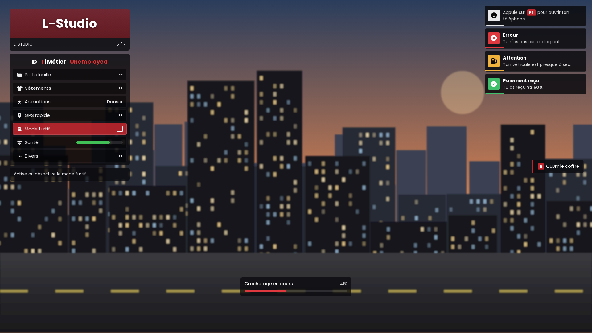
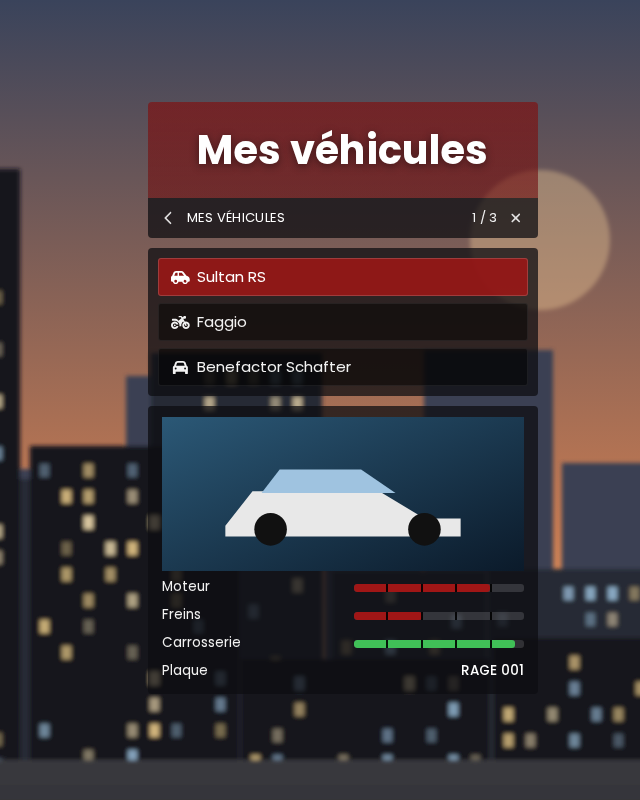
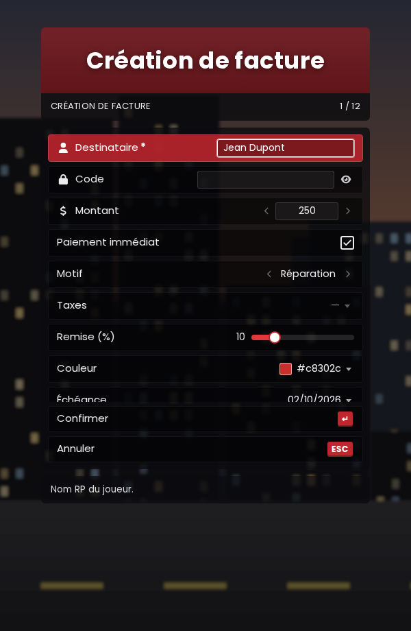
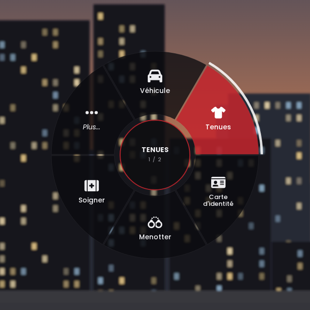
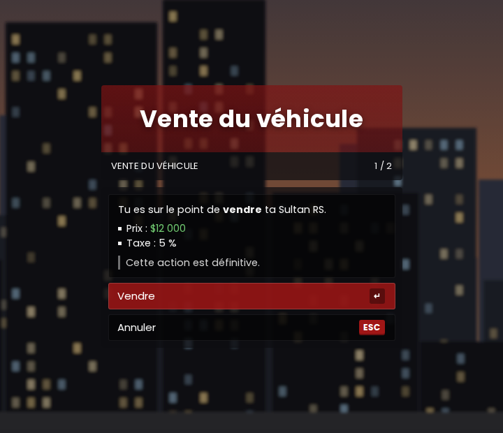
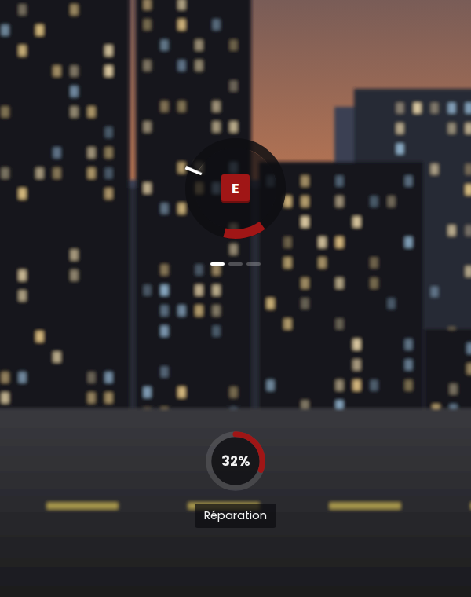
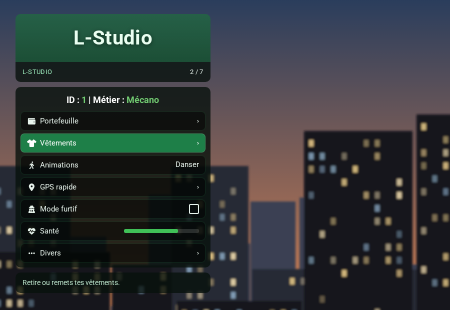

<div align="center">

# ox_lib · Studio UI

**Une refonte complète de l'interface d'ox_lib, dans un style menu FiveM moderne : panneaux sombres translucides, en-tête teintée, options en cartes.**

Remplace simplement ton ox_lib : **aucun script à modifier.**




</div>

---

## ✨ Présentation

**Studio UI** remplace toute l'interface NUI d'[ox_lib](https://github.com/overextended/ox_lib) par une interface faite maison, légère et entièrement personnalisable depuis le `server.cfg`.

L'interface fonctionne exactement comme celle d'origine : `lib.showMenu`, `lib.showContext`, `lib.notify`, `lib.progressBar`, `lib.inputDialog`, `lib.alertDialog`, `lib.showTextUI`, `lib.addRadialItem` et `lib.skillCheck` gardent les mêmes paramètres et les mêmes retours. Tes ressources existantes (ox_inventory, ox_target, tes scripts perso…) continuent de fonctionner, avec le nouveau look.

## 🖼️ Aperçu

| Context menu | Formulaire (input dialog) |
|:---:|:---:|
|  |  |

| Radial menu | Fenêtre de confirmation |
|:---:|:---:|
|  |  |

| Skill check & cercle de progression | Exemple de thème vert (via server.cfg) |
|:---:|:---:|
|  |  |

## 📦 Composants restylés

- **Menu** (`lib.registerMenu` / `lib.showMenu`) : en-tête, sous-titre avec compteur, ligne d'info, listes `‹ valeur ›`, cases à cocher, barres de progression, description.
- **Context menu** (`lib.registerContext`) : sous-menus, bouton retour, options désactivées, panneau de statistiques avec image et barres.
- **Notifications** (`lib.notify`) : 4 types colorés, barre de temps, 8 positions.
- **Barre et cercle de progression** (`lib.progressBar` / `lib.progressCircle`).
- **TextUI** (`lib.showTextUI`) : les touches `[E]` s'affichent comme de vraies touches.
- **Formulaires** (`lib.inputDialog`) : tous les types de champs, avec listes, calendrier, sélecteur d'heure et de couleur faits sur mesure (les sélecteurs natifs ne fonctionnent pas dans FiveM).
- **Fenêtre de confirmation** (`lib.alertDialog`) : contenu Markdown, utilisable au clavier.
- **Radial menu** (`lib.addRadialItem`) : roue avec sélection à la direction de la souris et pages « Plus... ».
- **Skill check** (`lib.skillCheck`) : plusieurs étapes, choix des touches, indicateur de progression.

## 🚀 Installation

1. **Sauvegarde ton ox_lib actuel.**
2. Télécharge **`ox_lib.zip`** dans l'onglet [Releases](https://github.com/TStudio-59/Ox_lib-Design-style-RageUI/releases/latest).
3. Supprime l'ancien dossier `ox_lib`, puis place le nouveau dans tes ressources.
   > ⚠️ Le dossier doit s'appeler **exactement `ox_lib`**. Si tu télécharges le code avec le bouton vert « Code → Download ZIP », renomme le dossier obtenu (par exemple `Ox_lib-Design-style-RageUI-main` → `ox_lib`).
4. *(Optionnel)* Copie `ox_ui.cfg` à côté de ton `server.cfg`, puis ajoute `exec ox_ui.cfg` **avant** `ensure ox_lib` :
   ```cfg
   exec ox_ui.cfg
   ensure ox_lib
   ```
5. Redémarre ton serveur.

Il n'y a rien à compiler : l'interface est en HTML/CSS/JS, sans `pnpm` ni build.

## 🎨 Personnalisation depuis le server.cfg

Toutes les couleurs, la police, les arrondis et la taille se règlent avec des convars `ox_ui:*`, sans toucher aux fichiers de la ressource.

**La version courte, une seule ligne :**

```cfg
setr ox_ui:accent "rgb(31, 150, 86)"
```

Cette ligne recolore à elle seule l'en-tête, la sélection, les barres, les touches, le radial et le skill check.

**La version complète :** le fichier [`ox_ui.cfg`](ox_ui.cfg) contient un réglage prêt à l'emploi (rouge profond) avec 4 variantes à activer (vert, violet, orange, or). Le fichier [`ox_ui_exemple.cfg`](ox_ui_exemple.cfg) liste les 35 réglages disponibles avec leur explication.

| Convar | Rôle | Exemple |
|---|---|---|
| `ox_ui:theme` | Thème : `studio` ou `rageui` (menus natifs GTA) | `"studio"` |
| `ox_ui:accent` | Couleur principale | `"rgb(192, 38, 45)"` |
| `ox_ui:header` | Fond de l'en-tête | `"rgba(150, 18, 24, 0.62)"` |
| `ox_ui:background` | Fond des panneaux | `"rgba(12, 12, 15, 0.78)"` |
| `ox_ui:item` | Fond d'une option | `"rgba(0, 0, 0, 0.45)"` |
| `ox_ui:selected` | Fond de l'option sélectionnée | `"rgba(192, 38, 45, 0.88)"` |
| `ox_ui:text` | Couleur du texte | `"rgb(236, 236, 239)"` |
| `ox_ui:font` | Police (Poppins et Roboto incluses, sinon Google Fonts) | `"Poppins"` |
| `ox_ui:radius` | Arrondi des coins (px) | `"6"` |
| `ox_ui:rows` | Options visibles avant défilement | `"9"` |
| `ox_ui:scale` | Taille de l'interface | `"auto"` |
| `ox_ui:notify_success` … | Couleur de chaque type de notification | `"rgb(63, 191, 107)"` |

Quelques règles :

- Utilise toujours **`setr`** (et pas `set`), pour que la valeur soit envoyée aux joueurs.
- Place les lignes **avant** `ensure ox_lib`.
- Écris les couleurs de préférence en `rgb()` ou `rgba()`. Le dernier nombre de `rgba` est l'opacité (0 = invisible, 1 = opaque).
- Mets chaque commentaire `#` sur sa propre ligne, jamais à la fin d'un `setr`.
- Après une modification, fais `restart ox_lib`.

## 🧩 Nouveaux champs (optionnels)

Les menus et context menus acceptent trois champs supplémentaires. Ils sont ignorés si tu ne les utilises pas.

```lua
lib.registerMenu({
    id = 'menu_perso',
    title = 'L-Studio',
    subtitle = 'Menu personnel',                        -- texte sous le titre (défaut : le titre)
    info = 'ID : ~r~1~s~ | Métier : ~r~Unemployed~s~',  -- ligne d'info centrée au-dessus des options
    banner = 'nui://mon_script/html/banner.png',        -- image d'en-tête (390 × 96 px conseillé)
    options = {
        { label = 'Portefeuille', icon = 'wallet', description = "Argent, banque et transfert d'argent." },
        { label = 'Vêtements', icon = 'shirt' },
        { label = 'Animations', icon = 'person-walking', values = { 'Danser', "S'asseoir", 'Saluer' } },
    },
}, function(selected, scrollIndex, args)
    -- ton code
end)
```

Pour afficher des valeurs à jour (ID, métier, argent…), modifie `info` dans ta table juste avant `lib.showMenu`.

### Codes couleur GTA

Ils sont utilisables dans les titres, options, descriptions, notifications et le TextUI :

- `~r~` rouge, `~g~` vert, `~b~` bleu, `~y~` jaune, `~o~` orange, `~p~` violet, `~c~` gris, `~w~` blanc, `~s~` retour à la couleur normale ;
- `~h~` gras, `~n~` retour à la ligne ;
- `~INPUT_CONTEXT~` ou `[E]` affichent une touche.

Le Markdown léger fonctionne aussi : `**gras**`, `*italique*`, listes, `` `code` ``.

## ⚙️ Configuration avancée

Le fichier `web/build/assets/js/config.js` contient les réglages par défaut : thème, couleur d'accent, échelle, flèches `>>`, position du context menu… Les convars `ox_ui:*` du `server.cfg` restent prioritaires sur ce fichier.

Pour retoucher le style en profondeur, les variables CSS se trouvent en haut de `web/build/assets/theme-studio.css` (thème studio) et de `web/build/assets/rageui.css` (thème rageui).

La documentation détaillée (tous les réglages, le thème RageUI, les polices) se trouve dans [`README_RAGEUI.md`](README_RAGEUI.md).

## 🔍 Aperçu sans lancer le jeu

Ouvre `web/build/index.html` dans Chrome ou Edge. Un panneau de test apparaît en bas à gauche : il permet d'afficher chaque composant, de changer de thème et de couleur. Ce panneau n'existe pas en jeu.

## ❓ Questions fréquentes

**Est-ce que mes scripts vont casser ?**
Non. Les messages et les retours entre Lua et l'interface sont identiques à ceux d'ox_lib 3.39.0.

**Mes couleurs ne s'appliquent pas.**
Vérifie que tu utilises `setr` (et pas `set`), que les lignes sont avant `ensure ox_lib`, et qu'aucun commentaire n'est placé en fin de ligne. Si une couleur en `#...` ne marche pas, écris-la en `rgb(...)`.

**Comment revenir à l'interface d'origine ?**
Remets ta sauvegarde, ou retélécharge ox_lib depuis le [dépôt officiel](https://github.com/overextended/ox_lib/releases).

**Une nouvelle version d'ox_lib est sortie.**
Cette refonte est basée sur ox_lib **3.39.0**. Ne remplace pas le dossier par une version officielle plus récente sans vérifier, sinon tu perdras l'interface. Surveille ce dépôt pour les mises à jour.

## 📜 Crédits et licence

- **[ox_lib](https://github.com/overextended/ox_lib)** par [Overextended](https://github.com/overextended), sous licence **LGPL-3.0**. Ce projet est une version modifiée d'ox_lib : l'interface `web/build/` a été réécrite, et `resource/client.lua`, `resource/interface/client/menu.lua` et `resource/interface/client/context.lua` ont été modifiés. Il reste sous la même licence (voir [`LICENSE`](LICENSE)).
- **Icônes** : [Font Awesome Free](https://fontawesome.com) 6.7.2, licence CC BY 4.0.
- **Polices** : [Poppins](https://fonts.google.com/specimen/Poppins) (SIL Open Font License) et [Roboto](https://fonts.google.com/specimen/Roboto) (Apache 2.0).

Ce projet n'est affilié ni à Overextended, ni à Rockstar Games, ni à Cfx.re.

Projet **gratuit**, partagé avec ❤️ par **[TStudio-59](https://github.com/TStudio-59)**. Ne le revends pas : une étoile ⭐ sur le dépôt fait toujours plaisir !

Un bug ou une idée ? Ouvre une [issue](https://github.com/TStudio-59/Ox_lib-Design-style-RageUI/issues).
# Ox_lib-Design-style-RageUI

